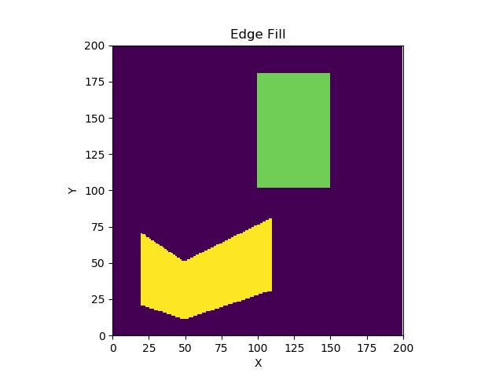

## 计算机图形学第四次作业——区域填充算法

> 1851197 周楷彬

* 文件目录：
  * `edge_fill.py`：有序边表算法
  * `utils.py`：一些辅助函数
  * `pic/`：结果图片

## 有序边表完整算法

### 算法思想

* **扫描线填充算法：**用水平扫描线从下到上扫描由多条首尾相连的线段构成的多边形，每根扫描线与多边形的某些边产生一系列交点。将这些交点按照x坐标排序，将排序后的点两两成对，作为线段的两个端点，以所填的颜色画水平直线。多边形被扫描完毕后，颜色填充也就完成了

* **有序边表算法：**为了简化交点计算，建立每条扫描线的活性边表。活性边表为包含了与当前扫描线相交的边（活性边）的链表，活性边按与扫描线交点x坐标递增排序。只需对当前扫描线的活性边表作更新，即可得到下一条扫描线的活性边表。

* **算法步骤：**

  1. 把新边表$ET[i]$中的边结点，用插入排序法插入活性边表$AET$，使之按X坐标递增顺序排序；

  2. 遍历$AET$表，把配对交点之间的区间(左闭右开)上的各像素$(X，Y)$，用$drawpixel(x,y,color)$改写象素颜色值；

  3. 遍历$AET$表，把$Y_{max}=i$的结点从$AET$表中删除，并把$Y_{max}＞i$的结果点的$X$值递增$\Delta X$；

  4. 重复各扫描线

* **新边表装配算法：**遍历所有边，取其顶点较小的$y$坐标$y_1$，将边加入到$y_1+0.5$对应的扫面线的新边表中

* **特殊情况：**

  * 当边平行于x轴时，边的斜率为0，无倒数，此时$\Delta X$为边的两个顶点x坐标之差

---

### 算法实现

* 新边表装配：

  ```python
  #装配新边表
  for i in range(n_points):
      p1 = i
      if i < n_points-1:
          p2 = i+1
      else:	#最后一条边由最后一顶点和第一个顶点构成
          p2 = 0
      if points[p1].y > points[p2].y:
          tmp = p1
          p1 = p2
          p2 = tmp
      if points[p2].y-points[p1].y  == 0: #边斜率为0
      	dx= points[p2].x-points[p1].x
      else:
          dx = (points[p2].x-points[p1].x)/(points[p2].y-points[p1].y)
          edge = Edge(points[p1].x,dx,points[p2].y)
          ET[points[p1].y-y_min+1].append(edge)
  ```

* 扫描线填充算法：

  ```python
  #扫描线算法
  for i in range(n_lines):
      y_current = y_min + i
      #插入新边
      for e_new in ET[i]:
          index_insert = 0
          for e_old in AET:
              if e_old.x > e_new.x:
                  break
              index_insert+=1
          AET.insert(index_insert,e_new)
      #填充
      for j in range(len(AET)//2):
          x1 = int(AET[2*j].x)
          x2 = int(AET[2*j+1].x)
          for x in range(x1,x2):
              img = drawPixel(img,x,y_current,color)
      #更新AET
      e_remove = []
      for j in range(len(AET)):
          if AET[j].y_max <= y_current:
              e_remove.append(j)
          else:
              AET[j].x += AET[j].dx
      AET = [ AET[j] for j in range(len(AET)) if not j in e_remove ]
      AET.sort(key=lambda e: e.x)
  ```
  

---

### 算法结果

* 